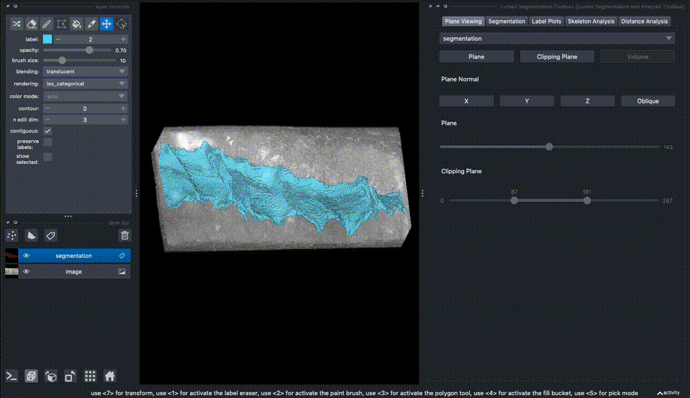
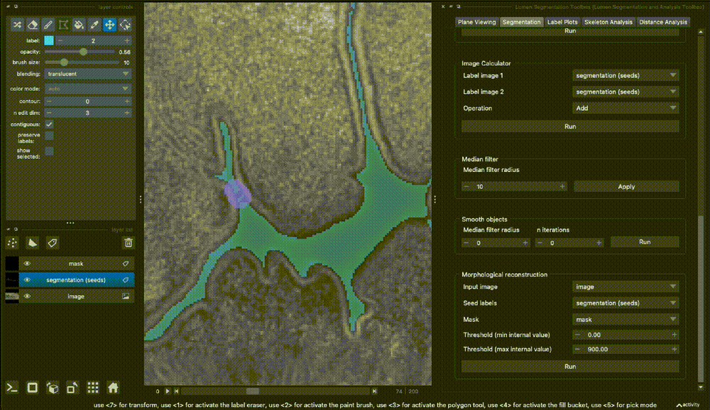
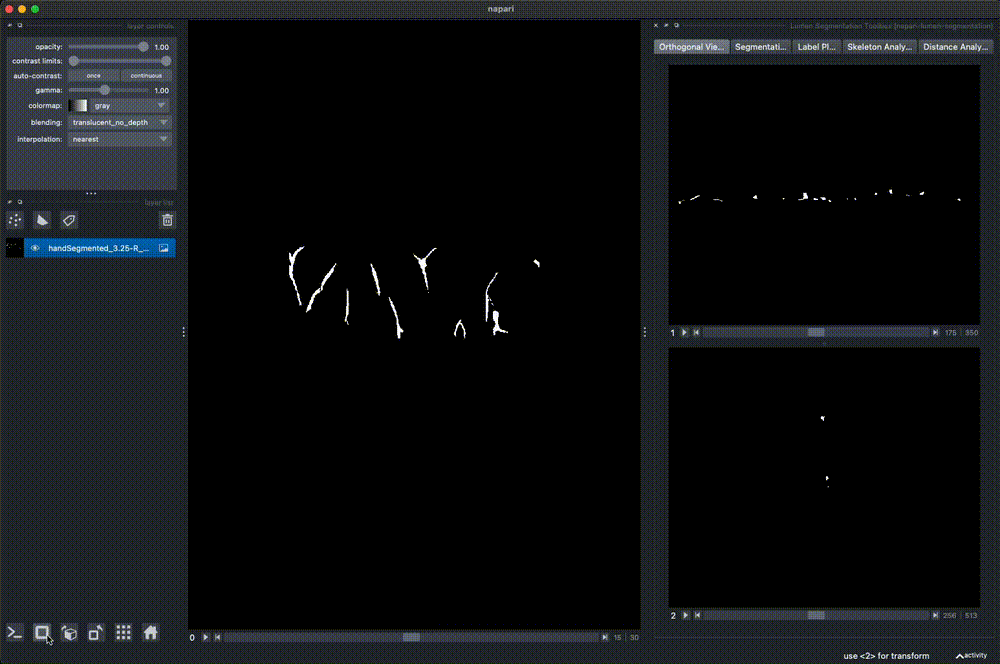
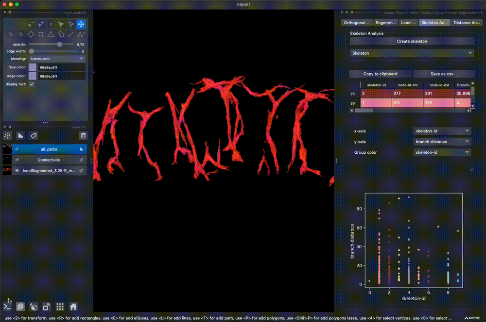
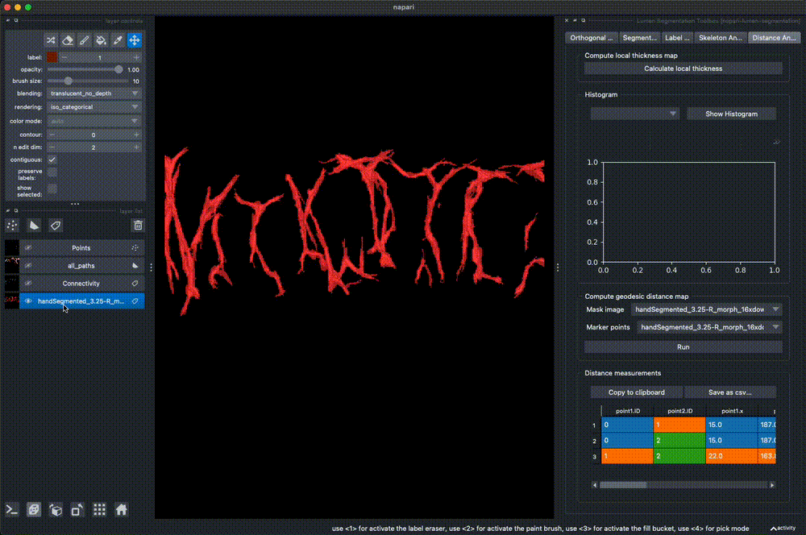

# napari-lumen-segmentation

This plugin is still under development. It serves as a toolbox for segmentation and analysis of luminal structures. 

The plugin heavily relies on several very useful open source packages and other napari plugins:
- orthogonal view widget: [napari multiple viewer widget](https://github.com/napari/napari/blob/e490e5535438ab338a23b17905a1952f15a6d27a/examples/multiple_viewer_widget.py)
- table widget: [napari-skimage-regionprops](https://github.com/haesleinhuepf/napari-skimage-regionprops)
- geodesic distances: [DIPlib](https://diplib.org/)
- skeleton analysis: [Skan](https://skeleton-analysis.org/stable/index.html) 
- local thickness measurements: [localthickness](https://pypi.org/project/localthickness/)
----------------------------------

This [napari] plugin was generated with [Cookiecutter] using [@napari]'s [cookiecutter-napari-plugin] template.

<!--
Don't miss the full getting started guide to set up your new package:
https://github.com/napari/cookiecutter-napari-plugin#getting-started

and review the napari docs for plugin developers:
https://napari.org/stable/plugins/index.html
-->

## Installation

You can install `napari-lumen-segmentation` via [pip]:

    pip install git+https://github.com/AnniekStok/napari-lumen-segmentation.git

## Usage

### Plane viewing
The 'Plane Viewing' tab implements viewing of planes and clipping planes in the 3D viewing mode.

### Manual segmentation correction
The 'Segmentation' tab aims to offer various tools for manual correction of a segmentation result, including: 
- connected component labeling in 2D and 3D
- filtering objects by size (measured properties can be viewed in an napari_skimage_regionprops based table and plot in the Label Plots tab)
- erosion and dilation of labels
- applying an intensity threshold to image and labels layers
- mathematical operations between two image/label layers
- median filter 
- median filter based smoothing of label layers
- morphological reconstruction by dilation

### Skeleton Analysis
The 'Skeleton Analysis' tab implements skeletonization (skimage.morphology.skeletonize) of the selected label image, and displays skeleton properties ([Skan](https://skeleton-analysis.org/stable/index.html))

### Distance Analysis
The 'Distance Analysis' tab implements geodesic distance measurements from [DIPlib](https://diplib.org/), calculating distance maps that reflect the geodesic distance of any pixel on the 'mask' layer to pixels on the 'marker' layer. The marker can be either a Points layer or a Label layer. In case of a Label layer or a single points layer, the geodesic distance map will be added to the viewer. In case of a multi-point Points layer, the euclidean and geodesic distances from each point to each other point are calculated, and visualized in a table and plot. 

The 'Calculate local thickness' button serves to run the 'local_thickness' function from [localthickness](https://pypi.org/project/localthickness/) on the selected Labels layer. In the resulting image, the voxel intensity reflects the local thickness of the foreground mask. 

Note that voxel anisotropy is NOT taken into account here, and that all measurements are in voxels. Data should therefore be rescaled to isotropic dimensions before using this plugin. 
## License

Distributed under the terms of the [BSD-3] license,
"napari-lumen-segmentation" is free and open source software

## Issues

If you encounter any problems, please file an issue along with a detailed description.

[napari]: https://github.com/napari/napari
[Cookiecutter]: https://github.com/audreyr/cookiecutter
[@napari]: https://github.com/napari
[MIT]: http://opensource.org/licenses/MIT
[BSD-3]: http://opensource.org/licenses/BSD-3-Clause
[GNU GPL v3.0]: http://www.gnu.org/licenses/gpl-3.0.txt
[GNU LGPL v3.0]: http://www.gnu.org/licenses/lgpl-3.0.txt
[Apache Software License 2.0]: http://www.apache.org/licenses/LICENSE-2.0
[Mozilla Public License 2.0]: https://www.mozilla.org/media/MPL/2.0/index.txt
[cookiecutter-napari-plugin]: https://github.com/napari/cookiecutter-napari-plugin

[file an issue]: https://github.com/AnniekStok/napari-lumen-segmentation/issues

[napari]: https://github.com/napari/napari
[tox]: https://tox.readthedocs.io/en/latest/
[pip]: https://pypi.org/project/pip/
[PyPI]: https://pypi.org/
